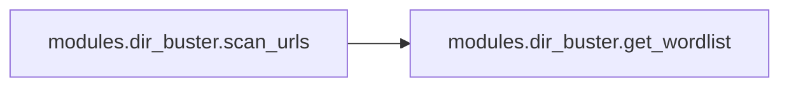

# Modules Dir Buster

[_Documentation generated by Documatic_](https://www.documatic.com)

<!---Documatic-section-Codebase Structure-start--->
## Codebase Structure

<!---Documatic-block-system_architecture-start--->
```mermaid
None
```
<!---Documatic-block-system_architecture-end--->

# #
<!---Documatic-section-Codebase Structure-end--->

<!---Documatic-section-modules.dir_buster.get_wordlist-start--->
## modules.dir_buster.get_wordlist

<!---Documatic-section-get_wordlist-start--->
<!---Documatic-block-modules.dir_buster.get_wordlist-start--->
<details>
	<summary><code>modules.dir_buster.get_wordlist</code> code snippet</summary>

```python
def get_wordlist(text_file):
    names = []
    with open(text_file, 'r+') as f:
        for line in f:
            line = line.strip()
            if len(line) == 0:
                continue
            else:
                names.append(line)
    return names
```
</details>
<!---Documatic-block-modules.dir_buster.get_wordlist-end--->
<!---Documatic-section-get_wordlist-end--->

# #
<!---Documatic-section-modules.dir_buster.get_wordlist-end--->

<!---Documatic-section-modules.dir_buster.scan_urls-start--->
## modules.dir_buster.scan_urls

<!---Documatic-section-scan_urls-start--->


### Object Calls

* modules.dir_buster.get_wordlist

<!---Documatic-block-modules.dir_buster.scan_urls-start--->
<details>
	<summary><code>modules.dir_buster.scan_urls</code> code snippet</summary>

```python
def scan_urls(domain_name):
    try:
        ssl_enabled = int(input('(SSL)Do you want to check urls with which prefix \n1. http:// \n2. https:// \n'))
    except (ValueError, EOFError, KeyboardInterrupt):
        return print('\n[!] Interrupted! or Wrong Value')
    if ssl_enabled == 1:
        ssl_enabled = False
    elif ssl_enabled == 2:
        ssl_enabled = True
    else:
        return print('Invalid Choice')
    clear_scr()
    url_prefix = 'https://' if ssl_enabled else 'http://'
    print('[+] Program will return to main menu once bruteforcing is complete')
    print('[+] You can press Ctrl+C to stop scanning')
    print('[+] Output Saved in dirbuster_output.txt [same folder as software]')
    print('[+] If you want to use your list of directories. Please edit *dark_fantasy_folder*/modules/wordlist.txt\n')
    print('[+] Brutforcing Started')
    paths = get_wordlist('modules/wordlist.txt')
    url_list = []
    valid_url = 0
    with Path('dirbuster_output.txt').open('w') as out_file:
        try:
            for path in paths:
                url = f'{url_prefix}{domain_name}/{path}'
                try:
                    response = requests.get(url)
                    if response.status_code == 200:
                        print(colored(f'[+] {url}', 'blue'))
                        url_list.append(url)
                        out_file.write(url + '\n')
                        valid_url += 1
                except requests.ConnectionError:
                    pass
        except KeyboardInterrupt:
            return print('You pressed Ctrl+C')
    return url_list
```
</details>
<!---Documatic-block-modules.dir_buster.scan_urls-end--->
<!---Documatic-section-scan_urls-end--->

# #
<!---Documatic-section-modules.dir_buster.scan_urls-end--->

[_Documentation generated by Documatic_](https://www.documatic.com)